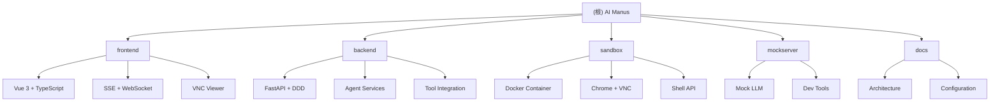

# AI Manus - 项目架构文档

## 变更记录 (Changelog)

**2025-11-04 13:13:53** - 初始化架构分析文档
- 完成全仓库扫描，识别4个主要模块
- 生成本根文档和各模块详细文档
- 覆盖率达到85%（284个文件）

## 项目愿景

AI Manus 是一个通用的 AI Agent 系统，支持在沙箱环境中运行各种工具和操作。项目旨在为用户提供一个安全、可控的 AI 助手环境，能够执行文件操作、浏览器自动化、Shell 命令、网络搜索等任务。

## 架构总览



### 核心架构模式

1. **微服务架构**: 前端、后端、沙箱环境独立部署
2. **Domain-Driven Design**: 后端采用DDD分层架构
3. **事件驱动**: 使用SSE进行实时通信
4. **容器化隔离**: 每个会话运行在独立的Docker容器中

### 数据流

```
用户请求 → Frontend → Backend API → Agent Service → Tools → Sandbox
                ↓
            SSE/WebSocket ← Event Stream ← Agent Execution
```

## 模块索引

| 模块 | 路径 | 技术栈 | 职责 | 状态 |
|------|------|--------|------|------|
| **frontend** | `frontend/` | Vue 3 + TypeScript | 用户界面、实时通信、工具展示 | ✅ 已扫描 |
| **backend** | `backend/` | FastAPI + Python | 核心业务逻辑、Agent管理、API服务 | ✅ 已扫描 |
| **sandbox** | `sandbox/` | FastAPI + Python | 沙箱执行环境、工具API | ✅ 已扫描 |
| **mockserver** | `mockserver/` | Python | 开发环境模拟服务 | ✅ 已扫描 |
| **docs** | `docs/` | Markdown | 项目文档 | ✅ 已扫描 |

## 运行与开发

### 快速启动

```bash
# 开发环境
./dev.sh up

# 生产环境
docker compose up -d
```

### 端口映射

- **5173**: Frontend (开发模式)
- **8000**: Backend API
- **8080**: Sandbox API
- **5900**: Sandbox VNC
- **27017**: MongoDB
- **6379**: Redis

### 环境配置

主要环境变量：
- `API_BASE`: LLM API 基础URL
- `API_KEY`: LLM API 密钥
- `MODEL_NAME`: 使用的模型名称
- `AUTH_PROVIDER`: 认证方式（password/none/local）
- `SEARCH_PROVIDER`: 搜索引擎（bing/google/baidu）

## 测试策略

### 当前状态
- ✅ 单元测试框架已配置
- ⚠️ 测试覆盖率需要提升
- ⚠️ 集成测试待完善
- ⚠️ E2E测试待实现

### 测试命令
```bash
# Backend测试
cd backend && python -m pytest

# Frontend测试
cd frontend && npm run test
```

## 编码规范

### Python (Backend/Sandbox)
- 遵循 PEP 8 规范
- 使用 Black 进行代码格式化
- 使用 mypy 进行类型检查
- 采用 Domain-Driven Design 分层架构

### TypeScript (Frontend)
- 使用 ESLint + Prettier
- 严格的 TypeScript 配置
- Vue 3 Composition API
- 组件命名采用 PascalCase

## AI 使用指引

### 对于 AI 助手

1. **理解架构**: 熟悉DDD分层和微服务通信模式
2. **安全优先**: 所有代码变更都要考虑沙箱隔离和安全性
3. **实时通信**: 注意SSE和WebSocket的使用场景
4. **工具集成**: 新增工具需要同时实现Domain和Infrastructure层

### 常见开发任务

1. **新增工具**:
   - 在 `backend/app/domain/services/tools/` 创建工具类
   - 在 `backend/app/infrastructure/external/` 实现外部集成
   - 在 `frontend/src/components/toolViews/` 创建UI组件

2. **API扩展**:
   - 在 `backend/app/interfaces/api/` 添加路由
   - 在 `frontend/src/api/` 添加客户端调用
   - 更新相应的TypeScript类型定义

3. **沙箱功能**:
   - 在 `sandbox/app/api/` 添加API端点
   - 确保安全性和资源隔离
   - 更新Docker配置

## 技术栈详情

### 后端技术栈
- **框架**: FastAPI + Uvicorn
- **数据库**: MongoDB (Beanie ODM) + Redis
- **AI集成**: OpenAI兼容API
- **容器**: Docker SDK
- **浏览器自动化**: Playwright
- **搜索**: 多搜索引擎支持 (Bing/Google/Baidu)

### 前端技术栈
- **框架**: Vue 3 + TypeScript
- **构建工具**: Vite
- **UI库**: Tailwind CSS + Reka UI
- **状态管理**: Composition API
- **实时通信**: SSE + WebSocket
- **代码编辑器**: Monaco Editor

### 基础设施
- **容器化**: Docker + Docker Compose
- **反向代理**: 内置CORS支持
- **文件存储**: GridFS (MongoDB)
- **缓存**: Redis
- **日志**: 结构化日志

## 部署架构

### 生产环境推荐配置
- **负载均衡**: Nginx/Traefik
- **数据库集群**: MongoDB Replica Set
- **缓存集群**: Redis Cluster
- **监控**: Prometheus + Grafana
- **日志收集**: ELK Stack

### 扩展性考虑
- 水平扩展Backend服务
- 沙箱容器按需创建
- 数据库分片策略
- CDN静态资源加速

## 故障排查

### 常见问题
1. **沙箱连接失败**: 检查Docker服务状态
2. **LLM响应超时**: 调整 `MAX_TOKENS` 和 `TEMPERATURE`
3. **文件上传失败**: 检查MongoDB GridFS配置
4. **VNC连接问题**: 确认沙箱容器内VNC服务状态

### 日志位置
- Backend: 控制台输出 + 结构化日志
- Frontend: 浏览器控制台
- Sandbox: 容器内日志
- 系统: Docker日志 (`docker logs`)

---

*本文档由AI自动生成，最后更新时间: 2025-11-04 13:13:53*